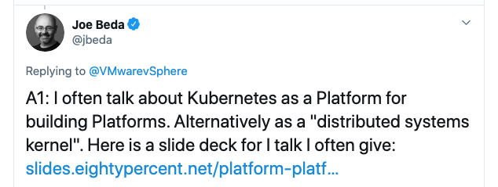
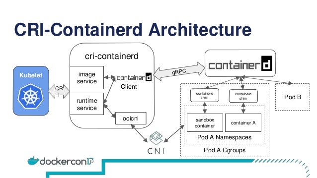
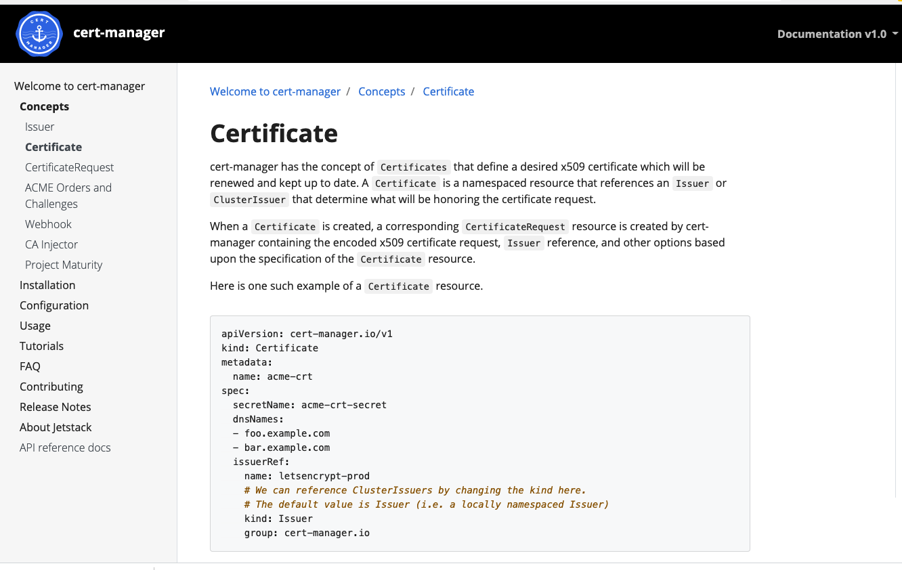
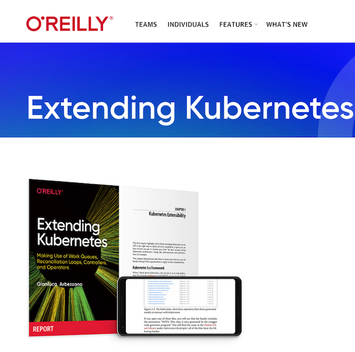

<style>
footer {
    margin-left: 60%;
}
p {
    font-size: 1.4rem;
}

.small {
    font-size: 0.5rem;
}
</style>

# Extending Kubernetes

The superpower behind the Kubernetes API

---

```yaml
apiVersion: batch/v1
kind: Job
metadata:
  name: hello
spec:
  template:
    # This is the pod template
    spec:
      containers:
      - name: hello
        image: busybox
        command: ['sh', '-c', 'echo "Hello, Kubernetes!" && sleep 3600']
      restartPolicy: OnFailure
    # The pod template ends here
```

Example coming from [kubernetes.io](https://kubernetes.io/docs/concepts/workloads/pods/) {.small}

---
<!-- _footer: "" -->


# Kubernetes is a declarative framework {style="margin-top:-30%!important;"}

If you use it just as end tool you are missing its real value

---



---


from [kubernetes.io](https://kubernetes.io/docs/concepts/overview/components/)
{.small}

---


from [SlideShare: Moby CRI Containerd](https://www.slideshare.net/mobyproject/cricontainerd) {.small}

---

# How you justify Kubernetes

---


Play your own game.

That's why services have their own API.

---


You know yourself, your team and your product. Build around your requirement

---

<!-- _footer: "" -->

# Who am I?


- Software Engineer at [Equinix Metal (Packet)](https://metal.equinix.com)
- Open Source maintainer for Kubernetes, Docker, TestContainer
- Docker Captain and CNCF Ambassador
- When not coding I grow vegetables

I am active on Twitter as [@gianarb](https://gianarb.it) {style="font-size:2rem;"}

---

Kubernetes follows the same rule, if kubectl is not enough because you have an
half way workflow that you like, or the kubectl makes your solution hard to
maintain, it is OK to build something by yourself.

---

There different ways to extend Kubernetes, here a couple:

1. A kubectl plugin.
2. Via Client-GO or any other SDK.
3. Custom Resource Definition.
4. [Aggregation layer](https://kubernetes.io/docs/concepts/extend-kubernetes/api-extension/apiserver-aggregation/)

---

Let's start with `kubectl`. It is by far the most flexible and easy way to
extend Kubernetes. You have to deliver an executable in your `$PATH` that starts
with `kubectl-*`.

---

Examples:

- A binary called `kubectl-ns` can be executed as `kubectl ns`
- A binary called `kubectl-profefe` can be executed as `kubectl profefe`

---

# kubectl-profefe

[Profefe](https://github.com/profefe) is an open source project to do continuous profiling of application
using [pprof](https://jvns.ca/blog/2017/09/24/profiling-go-with-pprof/), such as Golang.


---

I wrote a project called
[profefe/kube-profefe](https://github.com/profefe/kube-profefe) that acts as a
bridge between profefe and Kubernetes.

1. It serves a binary called `kprofefe`, it can run as Kubernetes cronjob and it
   collects profiles targeting application running in Kubernetes.
2. `kubectl-profefe` helps you to interact with profefe and Kubernetes.

---

```bash
$ kubectl profefe --help
It is a kubectl plugin that you can use to retrieve and manage profiles in Go.

Available Commands:
  capture     Capture gathers profiles for a pod or a set of them. If can filter by namespace and via label selector.
  get         Display one or many resources
  help        Help about any command
  load        Load a profile you have locally to profefe

Flags:
  -A, --all-namespaces                 If present, list the requested object(s) across all namespaces
      --as string                      Username to impersonate for the operation
      --as-group stringArray           Group to impersonate for the operation, this flag can be repeated to specify multiple groups.
      --cluster string                 The name of the kubeconfig cluster to use
      --context string                 The name of the kubeconfig context to use
  -f, --filename strings               identifying the resource.
  -h, --help                           help for kubectl-profefe
      --insecure-skip-tls-verify       If true, the server's certificate will not be checked for validity. This will make your HTTPS connections insecure
      --kubeconfig string              Path to the kubeconfig file to use for CLI requests.
  -n, --namespace string               If present, the namespace scope for this CLI request
  -l, --selector string                Selector (label query) to filter on, supports '=', '==', and '!='.(e.g. -l key1=value1,key2=value2)

Use "kubectl-profefe [command] --help" for more information about a command.
```
---

Links about kubectl plugins:

- ["My experience with Krew to manage kubectl plugins"](https://gianarb.it/blog/my-experiene-with-krew-to-manage-kubectl-plugins)
- ["kubectl flags in your plugin"](https://gianarb.it/blog/kubectl-flags-in-your-plugin)

---

# Client GO and other SDKs

Kubernetes API works as any other API. There are client libraries that you can
use in many languages or it works via HTTP, and all the languages have an HTTP
client available.

---

# Not all the languages are the same

There are official supported an unofficial libraries available out there.
Go, Javascript, Haskell, Python, Java, Dotnet are supported by the Kubernetes
community, you can check out the actual [documentation](https://kubernetes.io/docs/reference/using-api/client-libraries/).

All of them are in different state, **Golang** is well done.

---

`kprofefe` the binary I told you about before uses the [client-go]() library to
do a couple of things:

- Retrieve pods filtered according to `label section` or/and per `namespace` in
  order to get the right targets for profefe
- It uses the annotations for a particular pod in order to figure out where the
  pprof server runs (the right port and path)

---

# Get pods

```golang
// GetSelectedPods returns all the pods with the profefe annotation enabled
// filtered by the selected labels
func GetSelectedPods(clientset kubernetes.Interface,
	namespace string,
	listOpt metav1.ListOptions) ([]v1.Pod, error) {

	target := []v1.Pod{}
	pods, err := clientset.CoreV1().Pods(namespace).List(listOpt)
	if err != nil {
		return target, err
	}
	for _, pod := range pods.Items {
		enabled, ok := pod.Annotations[ProfefeEnabledAnnotation]
		if ok && enabled == "true" && pod.Status.Phase == v1.PodRunning {
			target = append(target, pod)
		}
	}
	return target, nil
}
```

---

# Port forward programmatically

<!-- _footer: "" -->

```golang
func PortForwardAPod(req PortForwardAPodRequest) error {
	path := fmt.Sprintf("/api/v1/namespaces/%s/pods/%s/portforward",
		req.Pod.Namespace, req.Pod.Name)
	hostIP := strings.TrimLeft(req.RestConfig.Host, "htps:/")

	transport, upgrader, err := spdy.RoundTripperFor(req.RestConfig)
	if err != nil {
		return err
	}

	dialer := spdy.NewDialer(
        upgrader,
        &http.Client{Transport: transport},
        http.MethodPost,
        &url.URL{Scheme: "https", Path: path, Host: hostIP})

	fw, err := portforward.New(
        dialer,
        []string{fmt.Sprintf("%d:%d", req.LocalPort, req.PodPort)},
        req.StopCh,
        req.ReadyCh,
        req.Streams.Out,
        req.Streams.ErrOut)
	if err != nil {
		return err
	}
	return fw.ForwardPorts()
}
```

Repository: [gianarb/kube-port-forward](https://github.com/gianarb/kube-port-forward) {.small}

---

# Custom Resource Definition (CRD)

Terraform has the concept of modules. A Terraform module is a bridge between an
external resource and Terraform. A CRD is the same, but with Kubernetes.

---

# Custom Resource Definition (CRD)

Native resources: Pod, Services, Deployment, StatefulSet, Ingress...

---

AWS Controllers for Kubernetes: Elastic Load Balancer, S3 bucket, CloudFormation Stack.
Checkout: [ACK](https://aws.amazon.com/blogs/containers/aws-controllers-for-kubernetes-ack/)

---

<!-- _footer: "" -->


---

<div class="mermaid" style="text-align:center;">
graph TD;
    client-go-->api-server;
    kubectl-->api-server;
    api-server-->crd-controller;
    crd-controller-->api-server;
</div>

<!-- mermaid.js -->
<script src="https://unpkg.com/mermaid@8.1.0/dist/mermaid.min.js"></script>
<script>mermaid.initialize({startOnLoad:true});</script>

---

# Why you should write a CRD?

Your team uses Kubernetes a lot, they know how to use the kubectl and client-go.
You can make available for them external services like DNS management or a binary/image repository with an user experience they already know.

---

Kubernetes gives you a bunch of useful features that you can leverage:

1. Authentication
2. Authorization
3. Audit Logs
4. Event System
5. CLI (kubectl) and client libraries

---

[](https://get.oreilly.com/ind_extending-kubernetes.html)

---

# Thank you

Any question?
Reach out to me via Twitter @gianarb.
