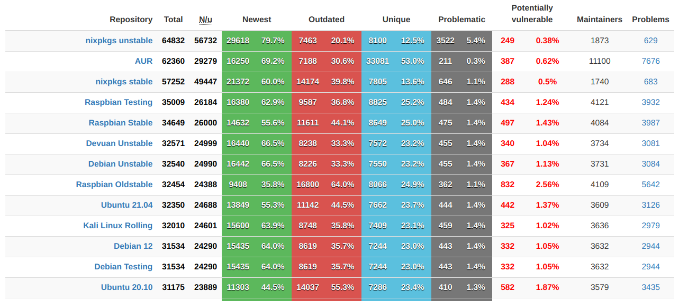

<style>
footer {
    margin-left: 60%;
    font-size: 0.5rem;
}
p {
    font-size: 1.2rem;
}

.small {
    font-size: 0.5rem;
}
</style>

# Ho odiato i sistemi di build, ma ora uso Nix

Non li apprezzo comunque... Preferiscono di gran lunga la pizza


---

# Perche' una "build ergonomica" fa la differenza

* Che ci piaccia o no, compiliamo tutto il giorno
    * Da sviluppatori scriviamo e compiliamo applicazioni
    * In operations dipendiamo da centinaia di pacchetti, in qualche modo compilati e rilasciati
    * Immutabilita' = compilare e "sparare nelle nuvole" macchine virtuali o containers
* Non possiamo farne a meno! Peggio della pizza!

---
<!-- _footer: "" -->

# Chi sono? 

- Combattente professionista contro il Rust Compiler per [Era Software](https://era.co/)
- Mi trovo spesso a saltare dalla barricata operations a quella dello sviluppo
- Quando non scrivo codice faccio giardinaggio e traffico in cortile
- Condivido esperienze piu' o meno fallimentari sul mio blog [gianarb.it](https://gianarb.it)


---

# Esercizio: lista di applicazioni che mi vengono in mente quando penso a "build"

## terraform pip gem composer ansible...
## virtualenv chef cake apt apk...
## rpm yum docker cargo yarn npm..

---

# Cosa non mi piace dei sistemi di build

- Non sono mai abbastanza "as code" come vorrei
- Non tengo conto del fattore tempo. Pensano di non invecchiare mai.
- In base al target (applicazione, sistema operativo, CI/CD, ambiente) cambiano.

---

# Discaimer

Io non sono un Build Engineer...
Tento di utilizzare Nix & NixOS da meno di un annetto...

---

# Nix linguaggio funzionale

Nix nasce come tesi di laurea, sperimentando come un approccio funzionale puro potesse essere applicato al sistema di build

```nix
with (import <nixpkgs> {});
derivation {
  name = "simple";
  builder = "${bash}/bin/bash";
  args = [ ./simple_builder.sh ];
  inherit gcc coreutils;
  src = ./simple.c;
  system = builtins.currentSystem;
}
```
---

Ogni pacchetto (derivation) viene trattato come un valore in un linguaggi funzionali puro, per esempio Haskell.

[Credits: How Nix works](https://nixos.org/guides/how-nix-works.html){class="small"}

---

I pacchetti sono funzioni, senza effetti collaterali, e non cambiano mai una volta compilati. Le derivations vengono salvate in una directory dedicata (default: /nix/store).

```
/nix/store/b6gvzjyb2pg0kjfwrjmg1vfhh54ad73z-firefox-33.1/
```

`b6gvzjyb2pg0kjfwrjmg1vfhh54ad73z` identifica non solo il pacchetto, ma anche le sue dipendenze.

[Credits: How Nix works](https://nixos.org/guides/how-nix-works.html){class="small"}

---

# kubectl 

```

{ stdenv, kubernetes, installShellFiles }:

stdenv.mkDerivation {
  pname = "kubectl";
  version = kubernetes.version;

  # kubectl is currently part of the main distribution but will eventially be
  # split out (see homepage)
  dontUnpack = true;

  nativeBuildInputs = [ installShellFiles ];

  outputs = [ "out" "man" ];

  installPhase = ''
    install -D ${kubernetes}/bin/kubectl -t $out/bin
    installManPage "${kubernetes.man}/share/man/man1"/kubectl*
    installShellCompletion --cmd kubectl \
      --bash <($out/bin/kubectl completion bash) \
      --zsh <($out/bin/kubectl completion zsh)
  '';

  meta = kubernetes.meta // {
    description = "Kubernetes CLI";
    homepage = "https://github.com/kubernetes/kubectl";
  };
}
```

[Credits: nixpkgs/kubectl](https://github.com/NixOS/nixpkgs/blob/master/pkgs/applications/networking/cluster/kubectl/default.nix#L7){class="small"}

---

# nixpkgs un package manager funzionale puro




[Credits: repology.org](https://repology.org/repositories/statistics/total){class="small"}

---

## Versioni multiple

Se ogni derivation (e varianti) tengono traccia delle proprie dipendenze, questo ci abilita ad aver diverse versioni della stessa libreria/applicazione installate nello stesso momento.

Questo perche' diverse versioni dello stesso pacchetto occupano un path dedicato all'interno del Nix Store.

[Credits: How Nix works](https://nixos.org/guides/how-nix-works.html){class="small"}

---

<!-- _footer: "" -->

# nixpkgs e' un repository git


---

Scriviamo un piccolo programma che verifica la versione di redis-server installata

```go
package main

import (
    "bytes"
	"os/exec"
)

func main() {
	var out bytes.Buffer
    cmd := exec.Command("redis-server", "--version")
	cmd.Stdout = &out

	if err := cmd.Run(); err != nil {
        panic(err)
	}

	println("redis version: %q\n", out.String())
}
```

---

```
$ tree
.
├── default.nix
├── go.mod
├── main.go
└── integration.nix
```

---

```
$ cat default.nix
with (import <nixpkgs>{ });

buildGoModule rec {
  name = "check-redis-version";
  version = "0.0.1";

  src = ./.;

  vendorSha256 = "sha256-pQpattmS9VmO3ZIQUFn66az8GSmB4IvYhTTCFn6SUmo=";

  meta = with pkgs.lib; {
    description = "Simple command-line tool to check redis version, written in Go.";
    homepage = "https://github.com/gianarb/check-redis-version";
    license = licenses.mit;
    platforms = platforms.linux ++ platforms.darwin;
  };
}
```
---

```
$ nix-build
this derivation will be built:
  /nix/store/y94dzm2awx4z17ljsbfzjkg8iblqs6i4-check-redis-version.drv
building '/nix/store/y94dzm2awx4z17ljsbfzjkg8iblqs6i4-check-redis-version.drv'...
unpacking sources
unpacking source archive /nix/store/b4ammxqc9ylgvwfa3wqznrj3hh520l5k-nix-test
source root is nix-test
patching sources
Building subPackage .
internal/unsafeheader
internal/cpu
internal/bytealg
io/fs
internal/syscall/unix
internal/poll
internal/testlog
os
strings
path/filepath
github.com/gianarb/check-redis-version
running tests
installing
post-installation fixup
shrinking RPATHs of ELF executables and libraries in /nix/store/pqdggygb67d46r30dmkycz2bklm4c0nh-check-redis-version
shrinking /nix/store/pqdggygb67d46r30dmkycz2bklm4c0nh-check-redis-version/bin/check-redis-version
patchelf: cannot find section '.dynamic'. The input file is most likely statically linked
strip is /nix/store/5ddb4j8z84p6sjphr0kh6cbq5jd12ncs-binutils-2.35.1/bin/strip
stripping (with command strip and flags -S) in /nix/store/pqdggygb67d46r30dmkycz2bklm4c0nh-check-redis-version/bin
patching script interpreter paths in /nix/store/pqdggygb67d46r30dmkycz2bklm4c0nh-check-redis-version
checking for references to /build/ in /nix/store/pqdggygb67d46r30dmkycz2bklm4c0nh-check-redis-version...
patchelf: cannot find section '.dynamic'. The input file is most likely statically linked
/nix/store/pqdggygb67d46r30dmkycz2bklm4c0nh-check-redis-version
```

---

Sono uno sviluppatore e voglio contribuire, sappiamo quanto sia complicato gestire le dipendenze di un applicazione

```
gianarb@huge ~/git/nix-test  $ go version
go: command not found
gianarb@huge ~/git/nix-test  $ nix-shell default.nix

[nix-shell:~/git/nix-test]$ go version
go version go1.16.7 linux/amd64
```

---

Questo puo' essere utilizzato anche per far diventare il sistema di CI/CD un
mero esecutore: FINALMENTE!

---

# GitHub action

```yaml
- uses: cachix/install-nix-action@v12
  with:
    nix_path: nixpkgs=channel:nixos-unstable
- run: ./ci-checks.sh
```

```
$ cat ./ci-checks.sh

#!/usr/bin/env nix-shell
...

```

[Credits: tinkerbell/tink](https://github.com/tinkerbell/tink/blob/main/.github/workflows/ci.yaml)

---

# NixOS

Nix come package manager puo' essere utilizzato su qualsiasi distribuzione Linux, ed anche su MacOS.

Ma fornisce una propria distribuzione basata appunto su Nix, chiamata NixOS

---

Si tratta di un sistema dichiarativo. Estremamante dichiarativo

```
# Contiene le configurazioni del sistema (applicazioni,
# firewall, servizi syastemd, moduli del kernel, udevs...)
$ cat /etc/nixos/configuration.nix

# Ti permette di aggiornare, testare o compilare la prossima versione
# Utilizzando nix garantisce atomicita' e rollback
$ nixos-rebuild test/switch/build
```

---

# Rollback


---

Troppo da spiegare, a questo punto apro il terminale ed inizio a far vedere cose, il codice sorgente lo trovate su [github.com/gianarb/dotfiles/nixos](https://github.com/gianarb/dotfiles/tree/master/nixos).

---

# Buona serata
